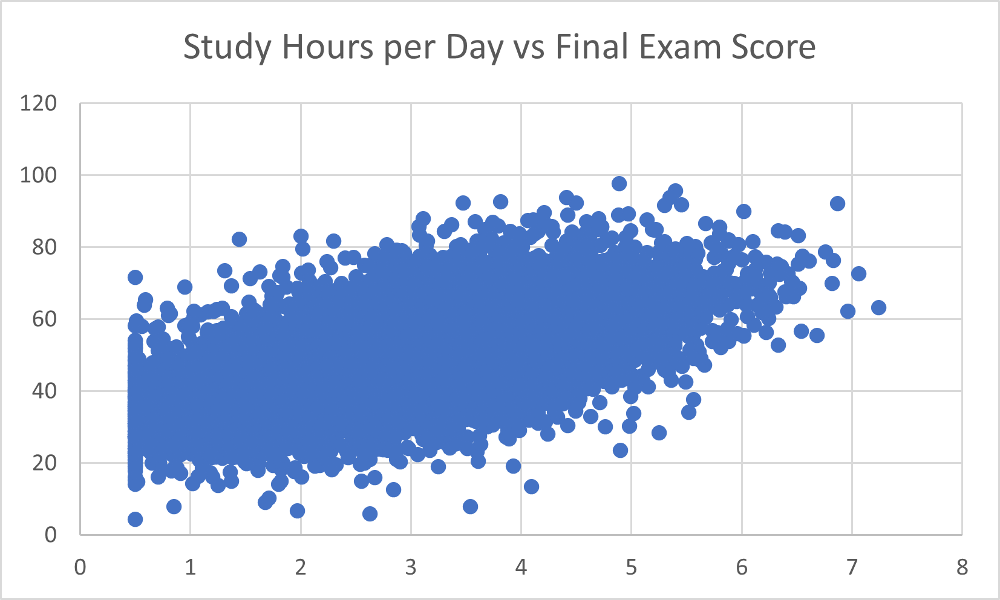
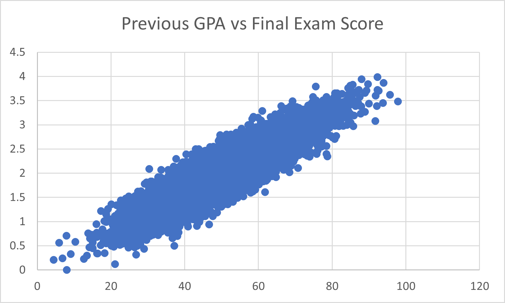

# Part 1: Data Analysis and Insight Generation

## 1. Data Overview
The "Student Exam Performance" dataset is used to examine multiple factors that influence students' academic performance and their final exam results. It provides a comprehensive view of student life, including demographics, daily lifestyle habits, and historical academic tracking records.
* **Number of Rows:** 10,000 rows.
* **Number of Columns:** 23 columns.
* **Data Context:** The dataset contains individual background profiles (gender, age, family income, parental education), daily routine indicators (study hours, sleep hours, social media usage, class attendance rate), and performance scores across specific subjects (Math, Reading, Writing, Science) alongside the final exam score.

## 2. Data Cleaning
A strict data cleaning process was conducted to ensure the absolute accuracy and reliability of the data findings:
* **Missing Values:** System diagnostics confirmed that there are 0 missing values across all 23 parameters. Therefore, no data imputation or row removal was needed.
* **Duplicate Rows:** The check for identical records indicated 0 duplicate rows out of the 10,000 student entries. The complete integrity of the data is fully preserved.

## 3. Descriptive Statistics
Below is a statistical summary of the quantitative core variables within the student tracking dataset (rounded to 2 decimal places):

| Variables | Count | Mean | Std Dev | Min | 25% | 50% (Median) | 75% | Max |
| :--- | :---: | :---: | :---: | :---: | :---: | :---: | :---: | :---: |
| **Age** | 10,000 | 16.49 | 1.12 | 15.00 | 15.00 | 16.00 | 17.00 | 18.00 |
| **Study Hours/Day** | 10,000 | 3.02 | 1.18 | 0.50 | 2.20 | 3.01 | 3.83 | 7.24 |
| **Attendance Rate (%)** | 10,000 | 84.70 | 9.51 | 50.80 | 78.28 | 85.10 | 91.90 | 100.00 |
| **Social Media Hours/Day** | 10,000 | 2.52 | 1.45 | 0.00 | 1.50 | 2.50 | 3.50 | 8.00 |
| **Final Exam Score** | 10,000 | 49.68 | 12.15 | 4.40 | 41.60 | 49.55 | 57.60 | 97.80 |
| **Previous GPA** | 10,000 | 1.98 | 0.54 | 0.00 | 1.61 | 1.99 | 2.35 | 3.99 |

* **Academic Performance Breakdown:**
  * Pass/Fail Distribution: 51.42% Fail (5,142 students) and 48.58% Pass (4,858 students).
  * Letter Grade Categories: Grade A: 10 students | Grade B: 85 students | Grade C: 904 students | Grade D: 3,829 students | Grade F: 5,172 students.

## 4. Key Insights

* **Insight 1 (Balancing Study Time and Social Media):** Statistical correlation results demonstrate that daily study hours hold a strong positive correlation with final exam scores (r = 0.58), whereas daily social media usage pulls down performance with a noticeable negative correlation (r = -0.25). This indicates that academic intervention strategies must go beyond merely asking students to study more; they need to integrate practical time-management frameworks that help students limit digital distractions.
* **Insight 2 (Academic Continuity and High Failure Risk):** Previous cumulative GPA displays an extremely high linear relationship with the final exam score (r = 0.89), which aligns with an alarming reality where more than half of the student group falls into the failing category (51.42% Fail and 5,172 students graded F). This strict consistency suggests that final test scores are highly predictable based on historical data; therefore, educational institutions should set up early academic warning systems to guide struggling students at the start of the semester.

## 5. Visualizations
Below are the data visualizations mapping out the behavioral and historical correlations discussed in the insights:

### Study Hours vs. Final Exam Score

### Previous GPA vs. Final Exam Score

---
## References
Eastern International University. (2026). *MIS 311: Introduction to Business Analytics - Student Exam Performance Dataset*. Moodle Repository.
